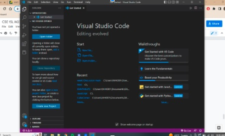
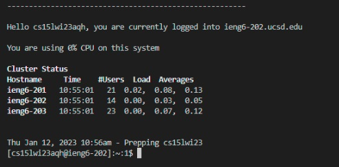
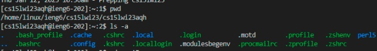

# Lab Report 1 CSE15L, by Kenneth Nguyen (A71458399)
This is a manual on how to recreate Lab 1 without error.
## Table of Contents:
- Installing VSCode
- Groups, Shared Lab Docs, and setting up your Lab Account.
- Remotely connecting to your SSH key (*remote* server)
- Running some remote commands
- git, GitHub, GitHub pages, and Markdown

---

## Part 0: Install VSCode
* Follow this [link](https://code.visualstudio.com/) to find instructions on setting up VSCode on all Operating Systems. 
* Most of the students in CSE15L should have this installed already as CSE8B and CSE11 is a prerequisite, and VSCode is the main preferred text editor. 

Here's a sample image of what your VSCode should look like.

## Part 1: Groups, Shared Lab Docs, and Setting up your Lab Account.
* Navigate to this [lab sheet](https://docs.google.com/spreadsheets/d/1xJN0bQ6b0whZwdimxtdBe41Ot-JgnvOJGFEh_VmcXcY/edit#gid=0), then find your specific lab group and time. Introduce yourselves and further instructions will be on the doc. This is where you will screenshot and answer several questions.

**LAB ACCOUNT:** 

* Use this [link](https://sdacs.ucsd.edu/~icc/index.php) to find your account. 
> Note that your account will be the three last letters of the cs15lwi23### string; you will use this in your ssh key.*

* Then use this [link to reset your password](https://docs.google.com/document/d/1hs7CyQeh-MdUfM9uv99i8tqfneos6Y8bDU0uhn1wqho/edit); it's a tutorial on how to reset your password. As the doc will reiterate, make sure to not click "Check password" and instead to click on the password itself and hit enter. If you run into trouble with the password, chances are it's too weak.

* After maybe 15 minutes, you should be ready to access your remote server using your SSH key login.

## Part 2: Remotely Connecting using your SSH key
* Run this command: 
`ssh cs15lwi23zz@ieng6.ucsd.edu` BUT replace the "zz" with your CSE15L 3 character string.
* Log in with the password you set earlier.
* If it works, congrats! If not, look backwards to see if you missed a step.

Here's what it looks like when your SSH login works.

## Part 3: Running Some Commands on your Remote Server
Some sample Linux commands:
* `cd ~` : *change directory to 'home'*
* `cd` : *change directory to to <insert path>*
* `ls` : *list working directory*
* `ls -a` : *list all files, including hidden files not shown by default*
* `cp /home/linux/ieng6/cs15lwi23/public/hello.txt ~/` : *cp is short for copy, and the first parameter is the file, the second parameter is the destination; here it is the home directory*

> Here is what looks like when you run the commands. The image shows: when we run "ls -a", we print a list of all files, including hidden files, in our directory.

* To better understand these commands, search them up on the internet; there are plenty resources.

## Part 4: GitHub, GitHub Pages, and MarkDown.
* Create a GitHub account if not created (previously created in my case)
* [Follow this link to access GitHub's website](https://github.com/)
* Create a Repository for your website, and create a .md (MarkDown) file.
> [(link for MarkDown cheat sheet)](https://commonmark.org/help/)
* Once you've created your file, go to the Repository's settings (not account settings), select Pages from the left, and deploy it.
* Reload the page in a minute, and it will link you to your pages. Congrats! It should say "Your site is live at ..."

THAT'S THE END!
This Lab Report was made by Kenneth Nguyen A17458399
