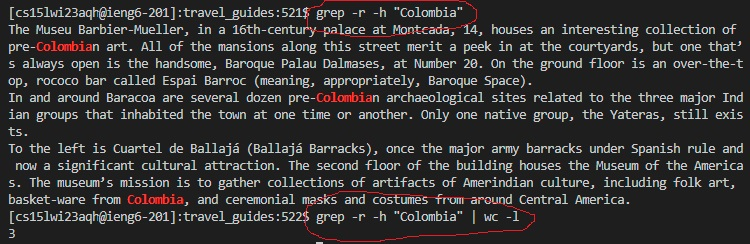
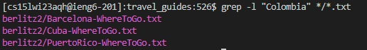
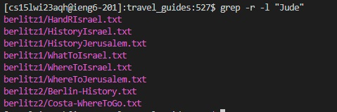
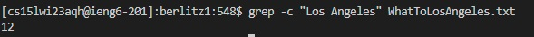

# Lab Report 3 by *Kenneth Nguyen, PIDA17458399*

### We will use `grep` for this Lab Report. In particular, it will be:
1. `grep -r`
2. `grep -h`
3. `grep -l`
4. `grep -c`

# Command 1: `grep -r`
### What it does: 
**`grep -r`:** *searches RECURSIVELY (hence the -r) for the line in all files of the directory*
> Structure: `grep -r #QUERY`, replace #QUERY with whatever word or string you search for.

> ^ From this screenshot, we see that grep recursively searches through all files in the directory of written_2 (our current directory) to find the match for the term.

> ^ Again, grep -r searches through all, even with different file names and subdirectoriesto find the matching query, which in this case was "charcoal".

### We will be using `grep -r` pretty often, especially in the following commands below. Remember, it recursively iterates through each file in every subdirectory. 

# Command 2: `grep -h`
### What it does: 
**`grep -h`:** *displays the matched lines but not the file name itself (per GeeksForGeeks)*
> Structure: `grep -h #QUERY #.txt` (or we can use grep -r -h #QUERY; regardless, replace #QUERY and #.txt with your custom string query and custom txt file respectively.)

**Let's look at how to use it:**

> ^ From this screenshot, we see that grep recursively (-r) searches through all files in the subdirectories of written_2, then upon finding the string query, prints out the LINE but **NOT** the file name that it was found in.

### We can use this to confirm whether or not a string is located in a directory/file, without needing to confirm which file the string it is in.

> ^ This one is a little special. From this first (top) red circle, not only do we search for "Colombia" in written_2, but also i nthe second (bottom) red circle, we combine it with a PIPE operator using `wc -l` to count how many occurrences/lines have Colombia in them. We see that in the entirety of written_2, there are 3 occurrences.

# Command 3: `grep -l`
### What it does: 
**`grep -l`:** *displays the list of file names that include the query keyword (per GeeksForGeeks)*
> Structure: `grep -l #QUERY #.txt` (or we can use grep -r -l #QUERY; regardless, replace #QUERY with your custom string query)

As mentioned in Command 3, we used -l with relation to the term "line." We can apply that idea to grep, although instead we use it to search for the file that it appears in. This can quicken and tidy up the process of finding which .txt files contain a certain query. 

> ^ From this screenshot, grep searches through all directories and all .txt files in the subdirectories of written_2 (\*\/\*.txt), then upon finding the string query, prints out all FILES but **NOT** the LINE that it was found in.

> ^ Using recursive search, we look for the string "Jude" to see which files contain the query. The listed .txt files contain "Jude".

# Command 4: `grep -c`
### What it does: 
**`grep -c`:** *prints the count of lines that match a pattern*
> Structure: `grep -c #QUERY #.txt` (replace #QUERY with desired string and #.txt with file name)

> ^ From this screenshot, grep counts and prints the number of occurrences of a search query in a given .txt file. 

> ^ Using recursive search, we can count how many occurences of a given string there are in all files in all subdirectories that contain the query. From the screenshot, only the *first* .txt file contains the string "Hawaii".

# *That's a wrap!*
### Sources:
https://www.geeksforgeeks.org/grep-command-in-unixlinux/
